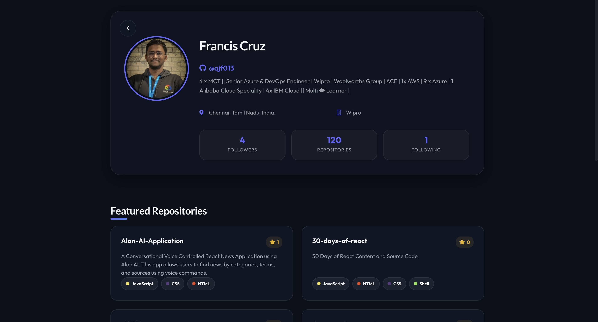
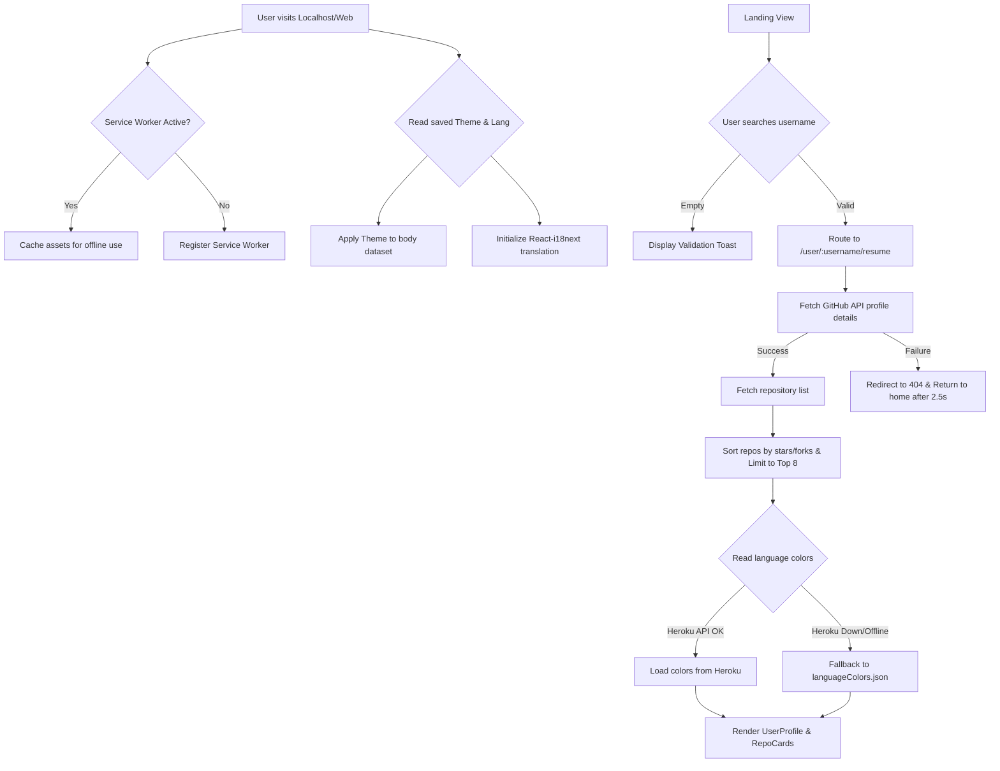

# 📄 GitHub Resume Generator & PWA

<p align="center">
  
</p>

An elegant, print-ready, professional resume builder built on React. This application converts any public GitHub profile and repositories into a beautiful developer resume. It is enhanced as a fully responsive **Progressive Web App (PWA)** with a dual **Dark/Light theme**, offline capabilities, multi-language support (including **Tamil**), and visual notifications.

---

## ⚡ Changes & Enhancements Made

1. **Design System & Glassmorphism**: Legacies of Material-UI v4 styling components were refactored into a custom-crafted design system powered by Vanilla CSS. Features premium gradients, responsive layout metrics, custom scrollbars, and frosted-glass paneling (`backdrop-filter`).
2. **Dark & Light Themes**: Introduced local state-theme managers with selectors, persisting choices inside `localStorage` and toggling stylesheets instantly using dataset tags on the `<body>` element.
3. **PWA Integration & Update Prompts**: Implemented Workbox service-workers registering install callbacks and update callbacks. Designed beautiful in-app notifications prompting users to install or hard-refresh on updates.
4. **Offline Language Colors**: Cached and embedded a local JSON database mapping languages to official GitHub hex colors (`languageColors.json`) to act as an offline fallback.
5. **Featured Repository Capping**: Intelligently limits display output to the top 8 repositories (sorted by star count and forks) to preserve high resume readability.
6. **Accessible Semantic UI Footer**: Introduced a custom `Footer/` module integrating Semantic UI icons, animations, and an embedded SVG for Twitter/X.
7. **Tamil Language Integration (`தமிழ்`)**: Integrated full Tamil translations across all interface titles, search components, stats cards, and toast overlays.

---

## 📂 Project Directory Structure

```text
github-resume/
├── public/
│   ├── favicon.ico             # App Favicon
│   ├── index.html              # Document index (loads fonts & meta)
│   ├── logo192.png             # PWA app icons (192px)
│   ├── logo512.png             # PWA app icons (512px)
│   ├── manifest.json           # PWA installable manifest configs
│   └── robots.txt
├── src/
│   ├── assets/
│   │   └── readme/
│   │       └── screenshot.png  # Demo screenshot
│   ├── components/
│   │   ├── Footer/
│   │   │   ├── Footer.jsx      # Social and copyright footer
│   │   │   └── Footer.css      # Footer animations and colors
│   │   ├── Header.js           # Theme toggle and language selector
│   │   ├── Loader.js           # Modern gradient spinner
│   │   ├── NotFoundPage.js     # Custom 404 user-not-found handler
│   │   ├── RepoCard.js         # Repository details cards
│   │   ├── SearchForm.js       # Search inputs with focus animations
│   │   ├── UserProfile.js      # Resume summary metrics & panels
│   │   └── index.js            # Unified export index
│   ├── constants/
│   │   ├── languageColors.json # Fallback language color mapping database
│   │   └── languages.js        # Supported language list
│   ├── App.js                  # PWA and theme listeners, routes wrapper
│   ├── i18n.js                 # i18next multilingual setups
│   ├── index.css               # Global stylesheet variables and base styles
│   ├── index.js                # App boots and service worker hooker
│   └── serviceWorkerRegistration.js # PWA service worker setups
├── package.json
└── yarn.lock
```

---

## 🏗️ Architecture & Component Flow

The application coordinates state flow between the Service Worker registry, local storage settings, translation frameworks, and the DOM interface:


```mermaid
graph TD
    A[User visits Localhost/Web] --> B{Service Worker Active?}
    B -- Yes --> C[Cache assets for offline use]
    B -- No --> D[Register Service Worker]
    
    A --> E{Read saved Theme & Lang}
    E --> F[Apply Theme to body dataset]
    E --> G[Initialize React-i18next translation]
    
    H[Landing View] --> I{User searches username}
    I -- Empty --> J[Display Validation Toast]
    I -- Valid --> K[Route to /user/:username/resume]
    
    K --> L[Fetch GitHub API profile details]
    L -- Success --> M[Fetch repository list]
    L -- Failure --> N[Redirect to 404 & Return to home after 2.5s]
    
    M --> O[Sort repos by stars/forks & Limit to Top 8]
    O --> P{Read language colors}
    P -- Heroku API OK --> Q[Load colors from Heroku]
    P -- Heroku Down/Offline --> R[Fallback to languageColors.json]
    
    Q & R --> S[Render UserProfile & RepoCards]
```

---

## 🛠️ Technology Stack

| Technology / Library | Logo / Badge | Version | Description |
| :--- | :--- | :--- | :--- |
| **React** |  | `16.14.0` | Library for building UI components. |
| **React Router** |  | `5.2.0` | Routing engine for Single Page Navigation. |
| **i18next** |  | `19.9.2` | Core localization manager for language switching. |
| **Axios** |  | `0.21.1` | HTTP Client for GitHub API integrations. |
| **Semantic UI** |  | `2.0.3` | Custom React social icon rendering. |
| **Vanilla CSS** |  | `CSS3` | Layout styling, themes, animations, & PWA toasts. |
| **Workbox (PWA)** |  | `Default` | Offline assets caching & update push handlers. |

---

## 🚀 Installation & Running Locally

Ensure you have **Node.js (v18+)** installed.

### 1. Clone the Repository
```bash
git clone https://github.com/ajf013/github-resume.git
cd github-resume
```

### 2. Install Package Dependencies
```bash
yarn install
# or
npm install
```

### 3. Run Development Server
```bash
NODE_OPTIONS=--openssl-legacy-provider yarn start
# or
NODE_OPTIONS=--openssl-legacy-provider npm start
```
*Open **[http://localhost:3000](http://localhost:3000)** in your browser.*

### 4. Create Production Build (For PWAs / Deployment)
```bash
NODE_OPTIONS=--openssl-legacy-provider yarn build
# or
NODE_OPTIONS=--openssl-legacy-provider npm run build
```

---

## 👥 Author

### 👤 Francis Ponnu Cruz I
> **Azure Cloud & DevOps Engineer | Microsoft Certified Trainer (MCT)**

#### 🌐 Connect with Me:
[](https://github.com/ajf013)
[](https://www.linkedin.com/in/ajf013-francis-cruz/)
[](https://x.com/Itsme_Ajf013)
[](https://fcruz.org)
[](https://linktr.ee/AJF013)

---

## 📄 License

This project is licensed under the MIT License - see the [LICENSE](./LICENSE) file for details.
