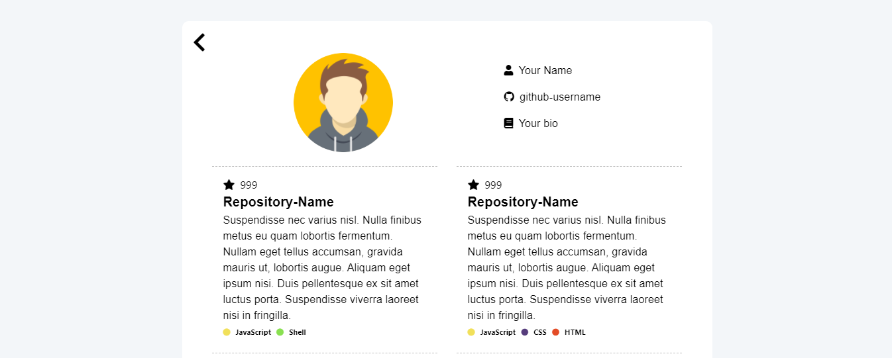

<h1 align='center'>GitHub Resume Generator</h1>




<p align="center">
<a href="https://github.com/ajf013/github-resume">
      
    </a><a href="https://githubresumeapp.netlify.app/">
      
    </a><a href="https://githubresumeapp.netlify.app/">
      
    </a><a href="https://github.com/ajf013/github-resume">
      
    </a><a href="https://github.com/ajf013/github-resume/search?l=JavaScript&type=code">
      
    </a><a href="https://github.com/ajf013/github-resume/tree/master/src">
      
    </a><a href="https://github.com/ajf013/github-resume">
      
    </a><a href="https://github.com/ajf013/github-resume/deployments">
      
    </a><a href="./LICENSE">
      
    </a>
</p>


## Table of Content

- [About](#about)
- [Built with](#built-with)
- [Installation](#installation)
- [Demo](#live-demo)

<br>

### 🌎 _Read in [other languages](./translations/Translations.md)_

<br>

<kbd>[](./translations/README.fr.md)</kbd>
<kbd>[](./translations/README.es.md)</kbd>
<kbd>[](./translations/README.de.md)</kbd>
<kbd>[](./translations/README.pt_br.md)</kbd>
<kbd>[](./translations/README.pl.md)</kbd>
<kbd>[](./translations/README.uk.md)</kbd>
<kbd>[](./translations/README.ru.md)</kbd>
<kbd>[](./translations/README.it.md)</kbd>
<kbd>[](./translations/README.te.md)</kbd>
<kbd>[](./translations/README.cs.md)</kbd>
<kbd>[](./translations/README.ta.md)</kbd>
<kbd>[](./translations/README.id.md)</kbd>
<kbd>[](./translations/README.si.md)</kbd>
<kbd>[](./translations/README.bg.md)</kbd>
<kbd>[](./translations/README.zh.md)</kbd>
<kbd>[](./translations/README.tr.md)</kbd>
<kbd>[](./translations/README.zh_tw.md)</kbd>
<kbd>[](./translations/README.kn.md)</kbd>
<kbd>[](./translations/README.ms.md)</kbd>
<kbd>[](./translations/README.mk.md)</kbd>
<kbd>[](./translations/README.ne.md)</kbd>    
<br>

<h2 id='about'>🤔 About</h2>

Aim of this repository is to generate `Github Resume` for each github users.

<h2 id='built-with'>🛠️ Built with</h2>

- [React JS](https://reactjs.org/) - Front-End JavaScript library
- [Material UI](https://material-ui.com/) - React UI Framework

<h2 id='installation'>Installation</h2>

To setup the app for development on your local machine, please follow the instructions below:

1. Clone the repo to your machine

```bash
git clone https://github.com/ajf013/github-resume.git
cd github-resume
```

2. Install packages

   If you use `npm`

   ```bash
   npm install
   ```

   or

   If you use `yarn`

   ```bash
   yarn
   ```

3. Run the development server

   If you use `npm`

   ```bash
   npm start
   ```

   or

   If you use `yarn`

   ```bash
   yarn start
   ```

4. Visit <http://localhost:3000>

<h2 id='live-demo'><a href="https://githubresumeapp.netlify.app/">Live Demo</a></h2>

[](https://app.netlify.com/sites/githubresumeapp/deploys)

## 📄 License

This project is licensed under the MIT License - see the [LICENSE](./LICENSE) file for details
